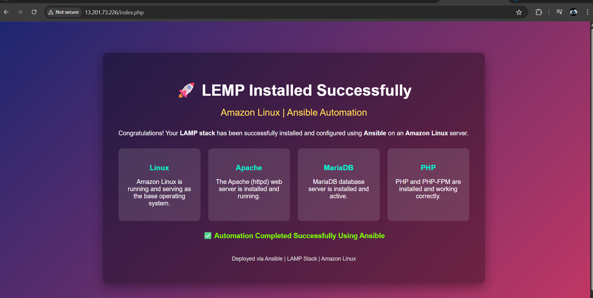
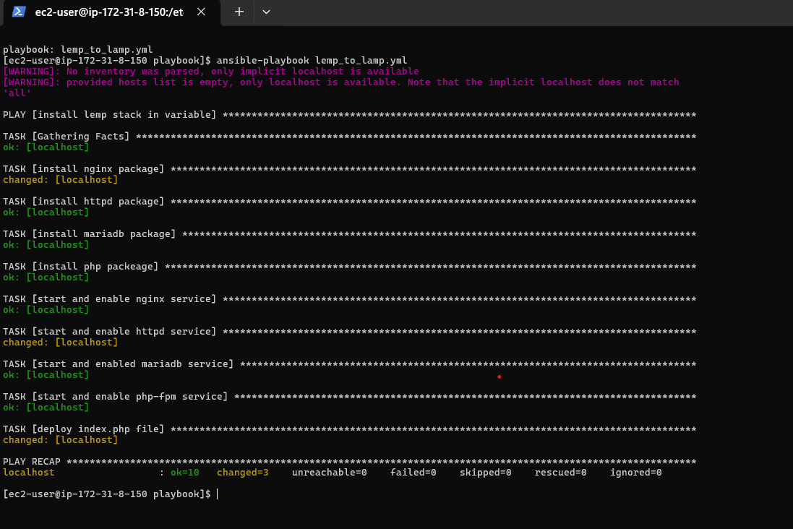
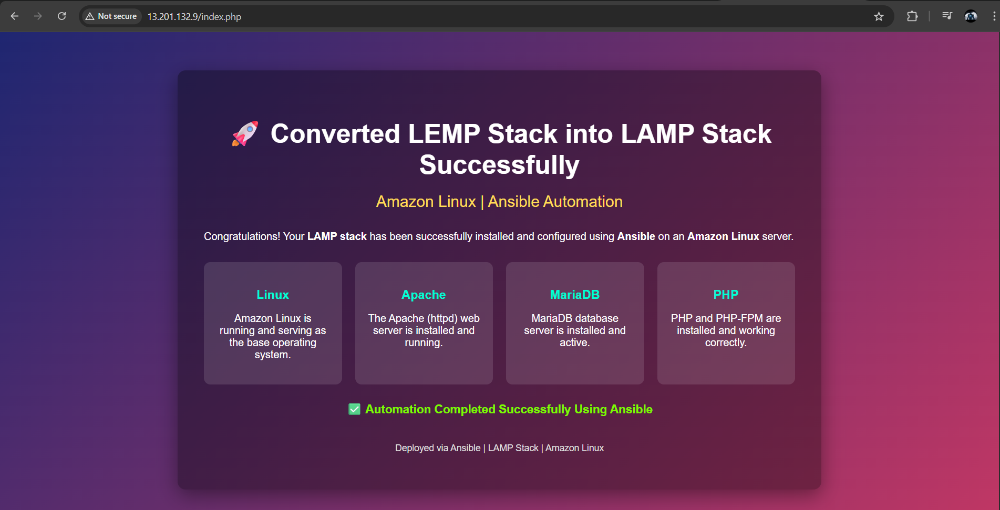

# LEMP to LAMP Stack Conversion Using Ansible on Amazon Linux

## Project Overview

This project demonstrates an automated conversion of a **LEMP stack (Linux, Nginx, MariaDB, PHP)** into a **LAMP stack (Linux, Apache, MariaDB, PHP)** using **Ansible** on an **Amazon Linux EC2 instance**.

Instead of performing a fresh installation, the goal of this project is to handle a **controlled and automated migration**, which is a common real-world DevOps scenario when aligning systems with organizational standards.

The automation ensures consistency, repeatability, and minimal manual intervention.

---


## Initial State: LEMP Stack Installed

### Ansible Playbook Execution (LEMP Stack)


### LEMP Stack Web Verification



---

## Problem Statement

In many environments, servers are already configured with a specific web stack.  
A frequent requirement is to **replace Nginx with Apache** while keeping the rest of the stack stable.

Manual migration can lead to:

- Configuration drift  
- Service conflicts  
- Downtime  

This project solves the problem using **Ansible-based automation**.

---

## Solution Approach

The migration was implemented using a **variable-driven Ansible playbook** that performs the following actions in sequence:

1. Stop and remove the Nginx web server  
2. Install Apache HTTPD  
3. Install and start MariaDB  
4. Install PHP and PHP-FPM  
5. Enable required services on system boot  
6. Deploy a PHP verification page  

The playbook is idempotent and can be safely re-executed.

---

## Tech Stack

- Operating System: Amazon Linux  
- Automation Tool: Ansible  
- Web Server: Apache HTTPD  
- Database: MariaDB  
- Backend Language: PHP, PHP-FPM  

---

## Ansible Playbook Design

The playbook uses **Ansible variables** to avoid hardcoding package and service names, making it clean and reusable.

### Variables Used

```yaml
web_sr: nginx
web_sr_2: httpd
db_sr: mariadb105-server
php_sr:
  - php
  - php-fpm
web_service: nginx
web_service_2: httpd
db_service: mariadb
php_service: php-fpm
web_file_path: /var/www/html/index.php
````

---

## Key Ansible Tasks

* Removed Nginx package and disabled its service
* Installed Apache HTTPD and enabled it
* Installed and started MariaDB service
* Installed PHP and PHP-FPM
* Deployed a custom `index.php` file using the Ansible `copy` module

All tasks are idempotent and follow best practices for configuration management.

---

## LEMP to LAMP Conversion Execution

### Ansible Playbook Execution (LEMP → LAMP)



### LAMP Stack Web Verification



---

## Execution Results

* Playbook executed successfully with zero failures
* All required services are running in the expected state
* Apache is actively serving PHP content

The system was successfully converted from **LEMP to LAMP**.

---

## Verification

After execution, the application can be verified using:

```text
http://12.256.25.35/index.php
```

Successful verification confirms:

* Apache is the active web server
* PHP processing is working correctly
* MariaDB service is running

---
## Medium Blog (Detailed Explanation)

A detailed step-by-step explanation of this project is published on Medium:

**Medium Article:**  
https://medium.com/@rajahire326/converting-lemp-stack-to-lamp-stack-using-ansible-on-amazon-linux-da1b5bc0ef76

This article covers:
- Real-world use case for LEMP to LAMP migration  
- Ansible automation strategy  
- Variable-driven playbook design  
- Execution results and verification  

---
## Conclusion

Manual server changes do not scale.
Automation ensures reliability, consistency, and speed.

This project showcases how Ansible can be used to safely manage infrastructure changes and migrate existing systems with confidence.

---

## Author

**Raj Ahire**
AWS & DevOps Engineer

LinkedIn: [https://www.linkedin.com/in/raj-ahire](https://www.linkedin.com/in/raj-ahire)
Medium: [https://medium.com/@rajahire326](https://medium.com/@rajahire326)


